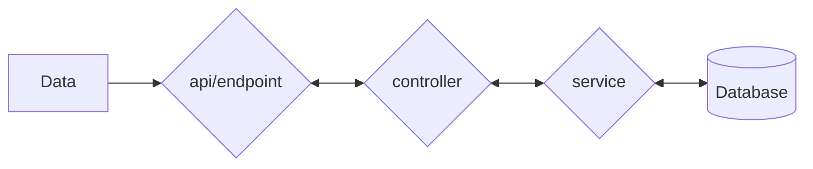
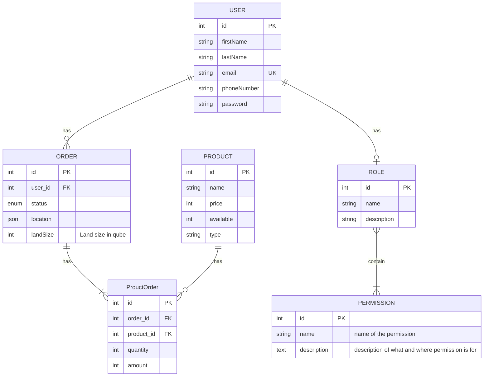

# agro-input-be

Agro-input provides essential online services that easy the process of ordering seeds and fertilizers to farmers accoring to the size of their land.

### Pre-requisite

- Node.js
- Express
- Typescript
- TypeORM and
- Postgres ad DB

## Archtecture
This projects levarages MVP patterns but also leveraging decoupling of classes so to allow further extention of the project without changing everthing of the project,
The project also uses layered archtecture where a request passes from endpoint to controller and then to the database through repositories,
On Database Querying, we are using Repository pattern to centralize the query construction code, providing a more object-oriented way of communicating with a collection of objects

### Data flow



### ER Diagram


### Installation localy

- Clone this project
- Install all dependencies `yarn`
- Create a `.env.dev` file and fill it with data from `.env.example`
- Build the app `yarn build`
- Start the server `yarn start`

### Testing

Start postman client and send a get request to `localhost:5070`


### Routes

#### Authentication

- Signup [POST] `/api/auth/signup
- login [POST] `/api/auth/login`

#### Users

- Get one's profile [GET] `/api/users/me`
- Update your profile [PUT] `/api/users/update`

#### Schema

- Signup Schema

```json
  firstname: string;
  lastname: string;
  email: string;
  password: string;
```

- Login

```json
  firstname: string;
  lastname: string;
```

- Profile

```json
  firstname?: string;
  lastname?: string;
  gender?: string;
  dob?: string;
  maritalStatus?: string;
  nationality?: string;
  profile?: string;
```
